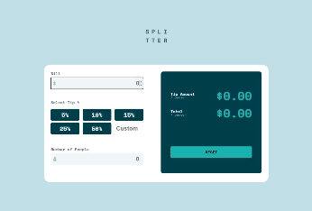

# SPLITTER
* 
 <b>SPLITTER</b> is a web application that divides the total amount and percentage by the specified amount. Page is responsive 

* 
 Easy to use 🧮 mobile friendly 📱

   

 

  To open SPLITTER
  

